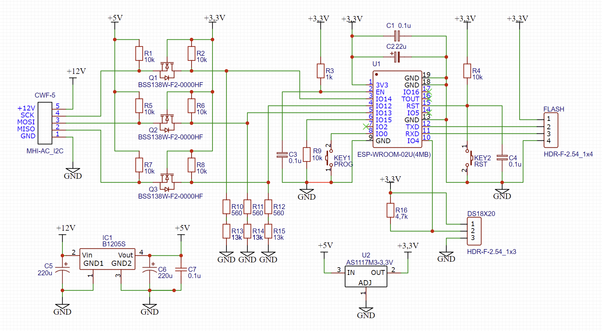
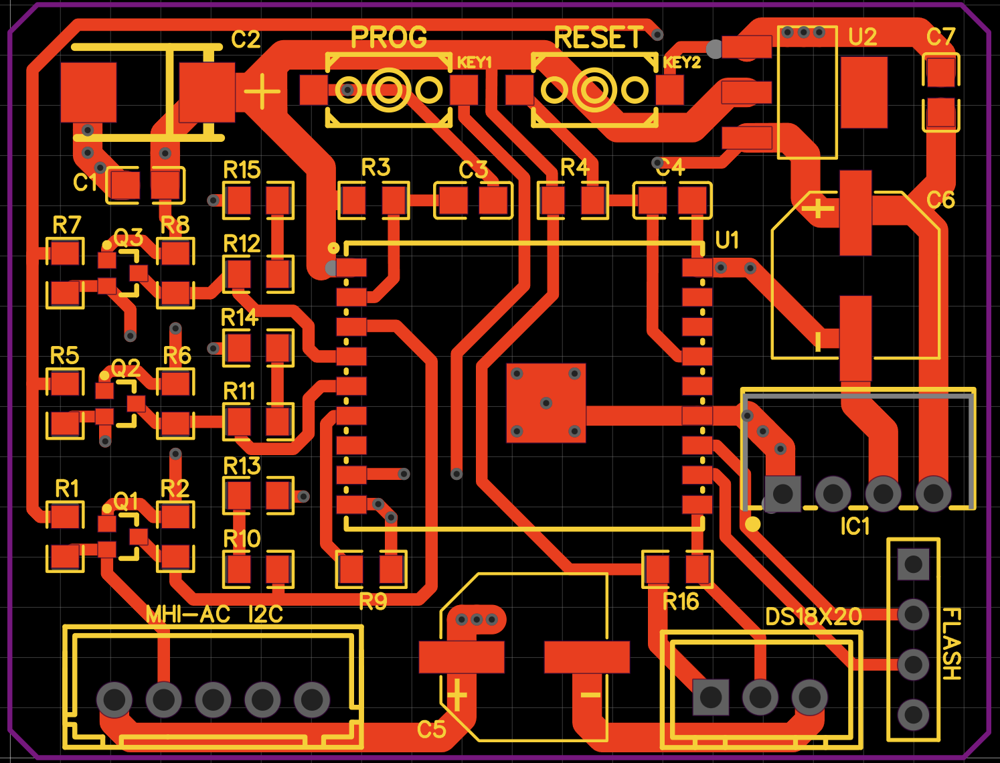

# Hardware
:warning: **This part of documentation under changes!** :warning:

## Schematic

## PCB (EasyEDA)

Информация для производства платы размещена в каталоге [hardware folder](Hardware). Там находятся файлы для производства платы в Gerber формате [Gerber_PCB_MHI adapter HW 4.0 _2023-11-16.zip](Hardware/Gerber/MHI-AC-Ctrl_v2.2_2021-01-22.zip), а так же 3D модель платы экспортированная из EasyEDA [JLCPCB](https://jlcpcb.com).

:warning: **Этот раздел всё еще в процессе изменений!!!** :warning: